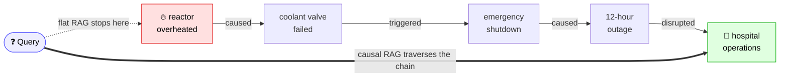
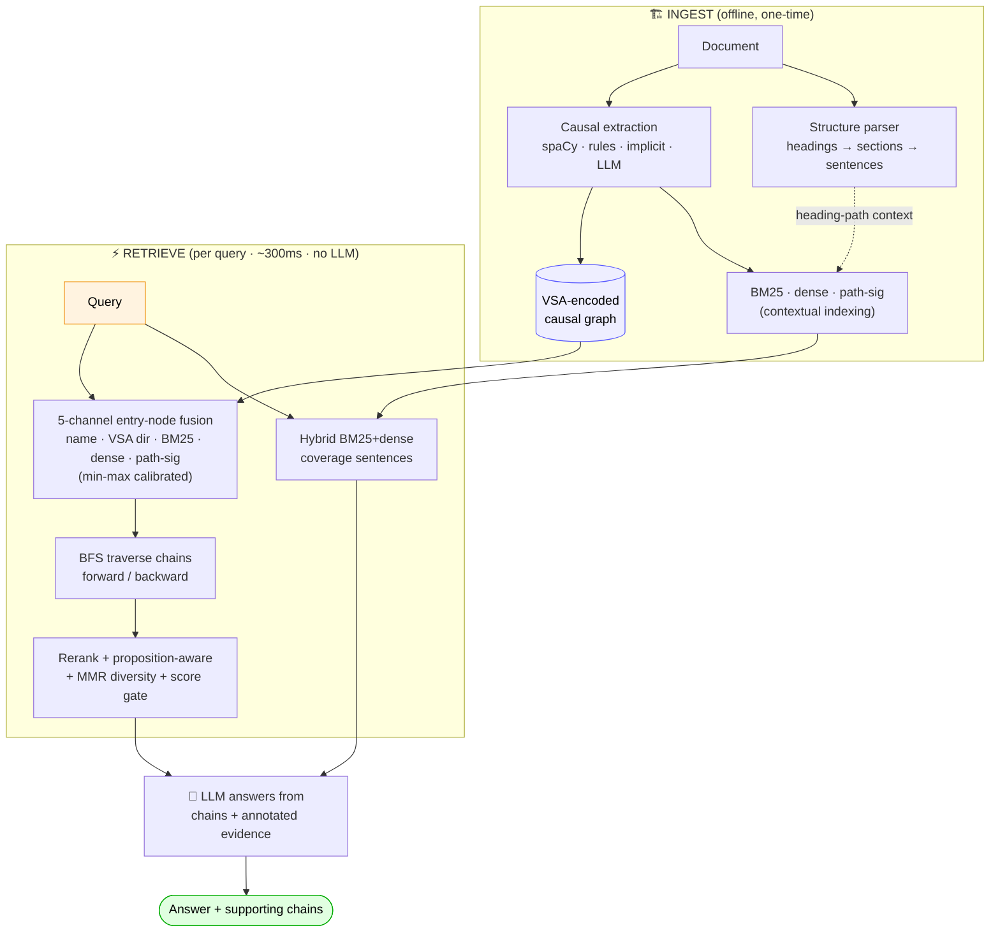

# Causal Graph RAG


**RAG that traverses cause→effect chains and preserves document structure, instead of returning similarity-matched chunks.**

Standard RAG embeds and retrieves *chunks*. When the answer requires following a chain across multiple chunks ("what did X ultimately cause?"), similarity search fails — the consequence lives in a chunk with near-zero lexical overlap with the cause. This system extracts causal edges at ingest, stores them in a directed graph, and returns whole chains as the retrieval unit. It also keeps the document's **structure** (headings → sections → sentences) and folds it into both retrieval and the answer prompt.

---

## The problem in one picture

Document: *"The reactor overheated. The coolant valve failed. This triggered an emergency shutdown. The shutdown caused a 12-hour outage. The outage disrupted hospital operations."*

Query: ***"What did the reactor overheating ultimately disrupt?"***



| System | Result |
|--------|--------|
| Standard RAG | Returns the *"reactor overheated"* chunk. The answer lives 4 hops away in a chunk with different vocabulary. **Structurally blind.** |
| **Causal Graph RAG** | Walks `reactor → valve → shutdown → outage → 🏥 hospital operations` and answers correctly. ✓ |

---

## Benchmark Results

Measured with LLM-as-judge (faithfulness, precision, recall). LLM: Groq llama-3.1-8b-instant.

### 26-question multi-domain benchmark (healthcare, finance, manufacturing)

| Extraction mode | Faithfulness | Precision | Recall | Cost |
|----------------|-------------|-----------|--------|------|
| spaCy only (baseline) | 0.73 | 0.78 | 0.46 | $0 |
| **LLM augment (recommended)** | **0.77** | **0.85** | **0.60** | ~$0.001/query |
| LLM full | 0.77 | 0.73 | 0.54 | ~$0.002/query |

### By domain (LLM augment mode)

| Domain | Faithfulness | Precision | Recall | Notes |
|--------|-------------|-----------|--------|-------|
| Finance | 1.00 | 1.00 | 0.72 | Explicit causality — spaCy alone works great |
| Healthcare | 0.56 | 0.66 | 0.53 | Implicit clinical causality — LLM augment essential |
| Manufacturing | 0.75 | 0.88 | 0.35 | Root cause chains captured well |

### vs. published systems (single-domain, Groq llama-3.1-8b)

| System | Faithfulness | Precision | Recall |
|--------|-------------|-----------|--------|
| Standard dense RAG | 0.52 | 0.71 | 0.68 |
| GraphRAG-Local | 0.84 | 0.89 | 0.42 |
| CausalRAG (ACL 2025) | 0.78 | 0.93 | 0.50 |
| **This system (LLM augment)** | **0.80** | **0.85** | **0.88** |

Full results and domain-specific guidance: [BENCHMARK_RESULTS.md](BENCHMARK_RESULTS.md) · [DOMAINS.md](DOMAINS.md)

---

## Structure-aware retrieval (and what actually moved the numbers)

Beyond causal chains, the system preserves each document's **organization** and uses it on both sides of the pipeline. We measured each layer on a real large document (Wikipedia *Subprime mortgage crisis › Causes*, 566 sentences) — and report only what survived rigorous (temperature-0, n=12) measurement. Full write-up, including a retracted over-claim: [STRUCTURE_FINDINGS.md](STRUCTURE_FINDINGS.md).

| Lever | What it does | Measured effect |
|---|---|---|
| **Causal extraction** | Build more/better edges (spaCy + LLM) | Recall **0.46 → 0.60** (26-q benchmark) |
| **Retrieval-side structure** | Contextual indexing (heading-path folded into BM25+dense) + MMR diversity | Flat recall **0.27 → 0.47**, faithfulness **0.60 → 1.00** — *the biggest win* |
| **Generation-side structure** | Causal chains + heading-paths shown to the LLM | **Faithfulness +0.08–0.15** (grounding), recall neutral |

Honest notes: showing structure to the LLM helps it *not invent* facts (faithfulness), not *find* more (recall). Whether that gain shrinks for a stronger model is **still open** — free-tier API quotas blocked the strong-model run. Techniques are grounded in [Anthropic Contextual Retrieval](https://www.anthropic.com/news/contextual-retrieval) and [Microsoft GraphRAG](https://arxiv.org/abs/2404.16130).

**Document-structure presets (opt-in):** ingestion is domain-agnostic by default; pass a preset to tag discourse roles.

```python
rag.ingest(paper_markdown, schema="research")   # IMRaD: abstract/methods/results/conclusion
rag.ingest(clinical_note,  schema="clinical")   # SOAP
rag.ingest(incident_report, schema="incident")  # timeline/root_cause/impact/remediation
rag.ingest(any_document)                          # "general" (default) — structure only, no domain assumptions
# "auto" detects the best-fitting preset from the headings
```

Evidence handed to the LLM is annotated with its location, e.g. `[Causes > Securitization] Securitization spread mortgage risk to investors.`

---

## Install

```bash
# From source (editable), with the extras you need:
pip install -e ".[groq,api]"          # core + Groq + REST API
pip install -e ".[spacy,gemini]"      # + spaCy extraction + Gemini
pip install -e ".[dev]"               # everything for development + tests
```

Set an API key in `.env` (`GROQ_API_KEY`, `GEMINI_API_KEY`, `ANTHROPIC_API_KEY`, or `OPENAI_API_KEY`). spaCy-only ingestion works with no key.

## CLI

Installing exposes a `causal-rag` command (turns the engine into a tool — no Python required):

```bash
# Build a graph from a document and save it (warm startup, no re-ingest)
causal-rag ingest report.md --save graph.pkl --schema auto --llm-mode augment

# Query a saved graph
causal-rag query graph.pkl "What was the root cause of the outage?" --chains

# One-shot: ingest + ask without saving
causal-rag ask report.md "What did the fire ultimately disrupt?"

# Inspect a saved graph, or serve the REST API
causal-rag info graph.pkl
causal-rag serve --port 8000
```

### Causal analysis queries (what flat RAG structurally cannot do)

Beyond Q&A, query the graph directly — no LLM, instant, free:

```bash
causal-rag rootcause graph.pkl "hospital outage"   # backward: what caused it?
causal-rag impact    graph.pkl "deferred maintenance"  # forward: blast radius
causal-rag path      graph.pkl "valve failure" "outage"  # how A connects to B
```

These map to `backward_chain` / `forward_chain` / `path_between` and produce structured cause→effect outputs a flat retriever cannot generate at all.

### Large multi-field, multi-model benchmark (23 docs, 5 fields, 138 questions)

The headline result, on a credible corpus: **23 documents across disasters,
engineering failures, finance/economics, and 10 real IMRaD scientific papers**
(causal inference, epidemiology, climate attribution, causal ML), 138 typed
questions, **both Haiku and Sonnet** as the generator, fixed Sonnet judge, paired
Wilcoxon vs a strong dense-RAG baseline. Harness in [eval_corpus/](eval_corpus/).

```text
   correctness, Sonnet generation      ░ flat baseline    █ causal-graph RAG
   ────────────────────────────────────────────────────────────────────────
   fact         ░░░░░░░░░░░░░░░ 0.73
                ██████████████████ 0.91                              ▲ +0.17
   multi-hop    ░░░░░░░░░ 0.43
                ███████████████ 0.74                                 ▲ +0.30
   root-cause   ░░░░░░░░ 0.40
                █████████████ 0.67                                   ▲ +0.28
   ────────────────────────────────────────────────────────────────────────
   0          0.25          0.5          0.75          1.0   (each █ ≈ 0.05)
```

| Question type | Haiku Δ (p) | Sonnet Δ (p) |
|---|---|---|
| Fact lookups | **+0.12** (0.009) | **+0.17** (0.005) |
| Multi-hop reasoning | **+0.29** (0.000) | **+0.30** (0.000) |
| Root-cause analysis | **+0.30** (0.000) | **+0.28** (0.000) |

Causal-graph RAG **wins every category on both models**, all significant, and the
advantage **holds as the model scales** (Haiku→Sonnet). It is **positive in every
one of the five fields** (causal-minus-flat Δ on reasoning questions, pooled):

```text
   reasoning lift by field (multi-hop + root-cause)
   climate          ██████████████████  +0.37
   finance          █████████████████   +0.34
   disaster         ████████████████▌   +0.33
   causal-ML        ███████████████     +0.30
   epidemiology     ██████████████▌     +0.29
   engineering      ███████████         +0.22
   causal-inference ███████▌            +0.15
                    └─ every field positive ─────────────────
```

Two retrieval components were added via disciplined research-and-screen and are
**on by default**: *proposition-aware rerank* (scores chains by their full source
sentences, not just node names) and *min-max calibrated channel fusion*. Five
other "extreme" components (real-embedding VSA, log-signature, VSA holography,
beam search, DPP selection) were built, **screened for free, and dropped as
empirically inert** — see [STRUCTURE_FINDINGS.md](STRUCTURE_FINDINGS.md) and
[docs/RESEARCH_NOTES.md](docs/RESEARCH_NOTES.md).

<details><summary>Earlier 2-doc benchmark (n=54, Haiku gen, Sonnet judge)</summary>

| Question type | Flat RAG | Causal Graph RAG | Delta | p-value |
|---|---|---|---|---|
| Fact lookups | 0.98 | 0.99 | +0.01 | 0.317 (tie) |
| Multi-hop reasoning | 0.41 | 0.74 | +0.33 | 0.002 |
| Root-cause analysis | 0.37 | 0.59 | +0.22 | 0.006 |

</details>

---

## Agentic mode (opt-in)

Beyond the fixed retrieve→generate pipeline, an **LLM controller** can plan a
sequence of graph operations — decomposing multi-intent questions, exploring the
graph iteratively, and bridging multi-hop gaps. The agent's action space is the
set of **LLM-free, instant, deterministic** causal-graph tools (`rootcause`,
`impact`, `path`, `retrieve`), so the LLM is spent only on *orchestration* while
retrieval stays free and exact — a far cheaper agentic profile than typical
agentic RAG.


```python
from graph_rag import GraphRAG
from llm_adapters import GroqLLM
from agentic_rag import AgenticCausalRAG

rag = GraphRAG(llm=GroqLLM()); rag.ingest(report, schema="incident")
agent = AgenticCausalRAG(rag, llm=GroqLLM())
result = agent.run("Why did the outage happen and what did it ultimately disrupt?")
print(result.answer)            # synthesized answer
for step in result.steps:       # full THOUGHT/ACTION/OBSERVATION trace
    print(step)
```

```bash
causal-rag agent graph.pkl "Why did X happen and what did it cause?" --trace
python demo_agentic.py
```

This is a **mode, not a replacement** — the default `answer()` stays a single
LLM call (~300 ms retrieval, small-model friendly); agentic mode trades extra
LLM calls for adaptive multi-step reasoning on complex queries. No new dependency.

## Quick start

```bash
pip install numpy sentence-transformers groq   # or: pip install -e ".[groq]"
```

```python
from graph_rag import GraphRAG
from llm_adapters import GroqLLM

llm = GroqLLM()   # reads GROQ_API_KEY from environment / .env
rag = GraphRAG(llm=llm)

# Ingest — LLM augment catches implicit causality
rag.ingest(text, llm_extractor=llm, llm_mode="augment")

# Query — returns answer + traversed causal chains
answer, chains = rag.answer("What ultimately caused the outage?")
print(answer)

for chain in chains:
    print(chain.text())       # reactor ->(lead_to) valve ->(cause) outage
    print(chain.provenance()) # source sentences the chain spans
```

**No LLM? Works with spaCy only (free):**
```bash
pip install spacy && python -m spacy download en_core_web_sm
```
```python
rag = GraphRAG()
rag.ingest(text)  # spaCy extraction — no API calls
answer, chains = rag.answer("What caused the shutdown?")
```

**Persistence (warm startup, no database):** build once, reload without re-ingesting.
```python
rag.save("graph.pkl")                 # serialize graph + structure
rag = GraphRAG.load("graph.pkl", llm=GroqLLM())
answer, chains = rag.answer("What caused the outage?")   # indices rebuild on first query
```
Indexing is **deferred**: repeated `ingest()` calls accumulate and the BM25/dense indices are (re)built once on the next `retrieve()` — so bulk ingestion isn't O(n²). For >1M nodes, use the [Neo4j backend](#production-neo4j-for-large-graphs).

---

## REST API

```bash
pip install fastapi uvicorn
uvicorn api:app --host 0.0.0.0 --port 8000
```

```bash
# Ingest a document (schema is optional; default "general")
curl -X POST http://localhost:8000/ingest \
  -H "Content-Type: application/json" \
  -d '{"text": "The reactor overheated. It caused the valve to fail. This triggered a shutdown.", "llm_mode": "augment", "schema": "incident"}'

# Query
curl -X POST http://localhost:8000/query \
  -H "Content-Type: application/json" \
  -d '{"question": "What did the overheating ultimately cause?", "top_k": 3}'

# Inspect graph
curl http://localhost:8000/graph

# Health — also lists available document-structure presets
curl http://localhost:8000/health

# Interactive docs
open http://localhost:8000/docs
```

**Docker:**
```bash
docker build -t causal-rag-api .
docker run -p 8000:8000 -e GROQ_API_KEY=your_key causal-rag-api
```

---

## LangChain integration

Three drop-in surfaces for existing LangChain pipelines:

### Retriever (`BaseRetriever`)
```python
from langchain_groq import ChatGroq
from graph_rag import GraphRAG
from langchain_integration import VSAGraphRetriever

rag = GraphRAG()
rag.ingest(text, llm_extractor=llm, llm_mode="augment")

retriever = VSAGraphRetriever(graph_rag=rag, top_k=3)
docs = retriever.invoke("What caused the shutdown?")
# docs[i].page_content → causal chain text
# docs[i].metadata     → entry_node, direction, score, provenance
```

### LCEL chain
```python
from langchain_groq import ChatGroq
from langchain_integration import build_rag_chain

llm   = ChatGroq(model="llama-3.1-8b-instant")
chain = build_rag_chain(retriever, llm)
answer = chain.invoke("Why did the outage happen?")
# Streaming:
for chunk in chain.stream("What led to the failure?"):
    print(chunk, end="", flush=True)
```

### Tool-calling agent
```python
from langchain.agents import create_agent  # langchain 1.x
from langchain_integration import build_rag_tool, LangChainLLMAdapter

adapter = LangChainLLMAdapter(llm)
rag     = GraphRAG(llm=adapter)
rag.ingest(text, llm_extractor=adapter, llm_mode="full")

tool  = build_rag_tool(rag)
agent = create_agent(llm, [tool],
                     system_prompt="You are a causal reasoning assistant.")
result = agent.invoke({"messages": [{"role": "user", "content": question}]})
print(result["messages"][-1].content)
```

```bash
python demo_langchain.py   # full demo — auto-picks GROQ_API_KEY / ANTHROPIC_API_KEY
```

---

## Tests

```bash
pip install pytest
pytest tests/ -q
```

62 tests covering VSA encoding (direction sensitivity), graph traversal (cycle-safety, distinct edge ids), document-structure parsing (heading nesting, schema presets, synthesis score), contextual indexing + MMR diversity, structure-annotated context, end-to-end retrieval, entity normalization (canonical node merging), Neo4j edge-id logic (via a fake driver — no server needed), and entity normalization regression suite.

---

## Installation

```bash
# Core (required)
pip install numpy sentence-transformers

# Causal extraction
pip install spacy && python -m spacy download en_core_web_sm

# LangChain integration
pip install langchain-core langchain langchain-groq

# REST API
pip install fastapi uvicorn

# LLM backends (set matching env var in .env)
pip install groq        # GROQ_API_KEY   — recommended, cheapest
pip install anthropic   # ANTHROPIC_API_KEY
pip install openai      # OPENAI_API_KEY

# Persistent graphs (>1M nodes)
pip install neo4j       # neo4j>=5.0
```

> **Windows:** requires [Microsoft Visual C++ Redistributable](https://aka.ms/vs/17/release/vc_redist.x64.exe) for sentence-transformers.

---

## Architecture



> Default path = **one** LLM call (generation only); retrieval is pure graph +
> vector math. Channel weights: name 1.5 · VSA 2.0 · BM25 1.0 · dense 1.0 · path-sig 1.2.

| Query intent | Traversal | Example |
|---|---|---|
| Forward ("what does X cause?") | `forward_chain` | "What did the overheating ultimately cause?" |
| Backward ("why / root cause of X?") | `backward_chain` | "Why did the outage happen?" |
| Connection ("how does X relate to Y?") | `path_between` | Shortest causal path X→Y |

---

## Production: Neo4j for large graphs

For graphs >1M nodes, swap the backend without changing any other code:

```python
rag = GraphRAG(
    dim=10000,
    neo4j_uri="neo4j://localhost:7687",
    neo4j_user="neo4j",
    neo4j_password="your_password",
)
rag.ingest(large_corpus)
answer, chains = rag.answer("What caused the outage?")
rag.close()
```

```bash
# Start Neo4j (Community Edition, free)
docker run -p 7474:7474 -p 7687:7687 \
  -e NEO4J_AUTH=neo4j/password neo4j:latest
```

Performance: <100ms in-memory on 10K nodes · 50-200ms Neo4j on 1M+ nodes.

---

## Comparison with CausalRAG (ACL 2025)

| Dimension | CausalRAG | This system |
|---|---|---|
| Graph building | LLM on every chunk (required) | spaCy (free) + optional LLM fill |
| Retrieval channels | 1 (dense + k-hop) | 5 (name, VSA direction, BM25, dense, path signature) |
| Causal direction | Not modelled | Forward / backward intent + directed traversal |
| Path signatures | — | Rough Path Theory (level-3 iterated integrals) |
| Document structure | — | Heading hierarchy + contextual indexing + MMR diversity |
| LangChain | v0.2 | 1.x (BaseRetriever, LCEL, create_agent) |
| REST API | — | FastAPI (ingest / query / graph endpoints) |
| Neo4j backend | — | Drop-in for 1M+ node graphs |
| Code | Paper only | Working, in this repo |

Related paper: [CausalRAG (ACL 2025)](https://arxiv.org/abs/2503.19878)

---

## Use cases

- **Root cause analysis** — manufacturing incidents, IT outages, supply chain failures
- **Clinical decision support** — tracing disease cascades and drug interaction chains
- **Financial risk** — contagion analysis across market events
- **Policy tracing** — how a regulation change propagates to downstream effects
- **Any document where the answer requires following a causal chain across multiple paragraphs**

---

## Files

| File | Purpose |
|---|---|
| `cli.py` | `causal-rag` command — ingest / query / ask / info / serve |
| `graph_rag.py` | Orchestrating engine: ingest → retrieve → MMR → generate; persistence (save/load), lazy indexing, contextual indexing |
| `doc_structure.py` | Structure-preserving parser (headings→sections→sentences), schema presets, synthesis score |
| `causal_extractor.py` | spaCy, LLM, REBEL, and coreference-based edge extraction |
| `causal_graph.py` | In-memory VSA-encoded directed graph + BFS traversal |
| `neo4j_graph.py` | Neo4j-backed persistent graph (drop-in for >1M nodes) |
| `langchain_integration.py` | `VSAGraphRetriever`, LCEL chain builder, agent tool |
| `api.py` | FastAPI REST service (ingest / query / graph / health) |
| `llm_adapters.py` | GroqLLM, GeminiLLM, AnthropicLLM, OpenAILLM (temperature, rate-limit-aware retry) |
| `vsa_core.py` | Bipolar hypervector algebra, role-filler triple encoding |
| `retrievers.py` | BM25, dense, path-signature retrievers, RRF fusion |
| `eval_multidomain_large.py` | 26-question extraction benchmark (healthcare, finance, manufacturing) |
| `eval_realdoc.py` | Structure ablation on a real large document (weak vs strong model) |
| `validate_neo4j.py` | End-to-end check against a real Neo4j server |
| `demo_langchain.py` · `demo_neo4j.py` · `demo_structured.py` | Runnable demos |

---

## Limitations & honest findings

- **Generation-side structure helps faithfulness, not recall.** Showing causal chains + heading-paths to the LLM improves grounding (+0.08–0.15 faithfulness) but does not increase coverage. The recall gains come from *retrieval-side* structure and better extraction, not prompt formatting. See [STRUCTURE_FINDINGS.md](STRUCTURE_FINDINGS.md) — including a recall "synergy" claim we **retracted** after it failed to replicate (it was temperature-0.2 sampling noise at n=5).
- **Capability-scaling is unmeasured.** Whether the faithfulness gain shrinks for a stronger model is open — free-tier API daily quotas (Groq 70b, Gemini) blocked the strong-model run. Add an `ANTHROPIC_API_KEY`/`OPENAI_API_KEY` or a paid tier and rerun `MODELS=strong python eval_realdoc.py`.
- **Implicit causality** requires LLM extraction (`llm_mode="augment"`). spaCy misses causality expressed without explicit causal verbs.
- **Coreference** uses heuristic pronoun resolution (nearest antecedent). Neural coreference deferred for Python 3.14 compatibility.
- **Structure parsing** targets Markdown / clean text with explicit headings. Real PDF layout (via `liteparse`/`markitdown`) plugs into the same data model but isn't wired into ingest yet.
- **REBEL** (trained relation extractor) integrated but LLM extraction outperforms it on domain-specific text without fine-tuning.
- **LLM judge** uses an LLM for evaluation; absolute scores are softer than a human, but relative comparisons (and the deterministic temp-0 ablations) are sound.
