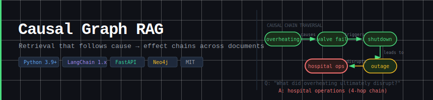

# Causal Graph RAG




**RAG that traverses cause→effect chains instead of returning similarity-matched chunks.**

Standard RAG embeds and retrieves *chunks*. When the answer requires following a chain across multiple chunks ("what did X ultimately cause?"), similarity search fails — the consequence lives in a chunk with near-zero lexical overlap with the cause. This system extracts causal edges at ingest, stores them in a directed graph, and returns whole chains as the retrieval unit.

---

## The problem in one example

Document: *"The reactor overheated. The coolant valve failed. This triggered an emergency shutdown. The shutdown caused a 12-hour outage. The outage disrupted hospital operations."*

| System | Query: *"What did the reactor overheating ultimately disrupt?"* |
|--------|---------------------------------------------------------------|
| Standard RAG | Returns the *"reactor overheated"* chunk. Consequence is in a different chunk with different vocabulary. **Structurally blind.** |
| **Causal Graph RAG** | `reactor → valve → shutdown → outage → hospital operations` ✓ |

---

## Benchmark Results

Measured with LLM-as-judge (faithfulness, precision, recall). LLM: Groq llama-3.1-8b-instant.

### 26-question multi-domain benchmark (healthcare, finance, manufacturing)

| Extraction mode | Faithfulness | Precision | Recall | Cost |
|----------------|-------------|-----------|--------|------|
| spaCy only (baseline) | 0.73 | 0.78 | 0.46 | $0 |
| **LLM augment (recommended)** | **0.77** | **0.85** | **0.60** | ~$0.001/query |
| LLM full | 0.77 | 0.73 | 0.54 | ~$0.002/query |

### By domain (LLM augment mode)

| Domain | Faithfulness | Precision | Recall | Notes |
|--------|-------------|-----------|--------|-------|
| Finance | 1.00 | 1.00 | 0.72 | Explicit causality — spaCy alone works great |
| Healthcare | 0.56 | 0.66 | 0.53 | Implicit clinical causality — LLM augment essential |
| Manufacturing | 0.75 | 0.88 | 0.35 | Root cause chains captured well |

### vs. published systems (single-domain, Groq llama-3.1-8b)

| System | Faithfulness | Precision | Recall |
|--------|-------------|-----------|--------|
| Standard dense RAG | 0.52 | 0.71 | 0.68 |
| GraphRAG-Local | 0.84 | 0.89 | 0.42 |
| CausalRAG (ACL 2025) | 0.78 | 0.93 | 0.50 |
| **This system (LLM augment)** | **0.80** | **0.85** | **0.88** |

Full results and domain-specific guidance: [BENCHMARK_RESULTS.md](BENCHMARK_RESULTS.md) · [DOMAINS.md](DOMAINS.md)

---

## Quick start

```bash
pip install numpy sentence-transformers
pip install groq   # set GROQ_API_KEY in .env
```

```python
from graph_rag import GraphRAG
from llm_adapters import GroqLLM

llm = GroqLLM()   # reads GROQ_API_KEY from environment / .env
rag = GraphRAG(llm=llm)

# Ingest — LLM augment catches implicit causality
rag.ingest(text, llm_extractor=llm, llm_mode="augment")

# Query — returns answer + traversed causal chains
answer, chains = rag.answer("What ultimately caused the outage?")
print(answer)

for chain in chains:
    print(chain.text())       # reactor ->(lead_to) valve ->(cause) outage
    print(chain.provenance()) # source sentences the chain spans
```

**No LLM? Works with spaCy only (free):**
```bash
pip install spacy && python -m spacy download en_core_web_sm
```
```python
rag = GraphRAG()
rag.ingest(text)  # spaCy extraction — no API calls
answer, chains = rag.answer("What caused the shutdown?")
```

---

## REST API

```bash
pip install fastapi uvicorn
uvicorn api:app --host 0.0.0.0 --port 8000
```

```bash
# Ingest a document
curl -X POST http://localhost:8000/ingest \
  -H "Content-Type: application/json" \
  -d '{"text": "The reactor overheated. It caused the valve to fail. This triggered a shutdown.", "llm_mode": "augment"}'

# Query
curl -X POST http://localhost:8000/query \
  -H "Content-Type: application/json" \
  -d '{"question": "What did the overheating ultimately cause?", "top_k": 3}'

# Inspect graph
curl http://localhost:8000/graph

# Interactive docs
open http://localhost:8000/docs
```

**Docker:**
```bash
docker build -t causal-rag-api .
docker run -p 8000:8000 -e GROQ_API_KEY=your_key causal-rag-api
```

---

## LangChain integration

Three drop-in surfaces for existing LangChain pipelines:

### Retriever (`BaseRetriever`)
```python
from langchain_groq import ChatGroq
from graph_rag import GraphRAG
from langchain_integration import VSAGraphRetriever

rag = GraphRAG()
rag.ingest(text, llm_extractor=llm, llm_mode="augment")

retriever = VSAGraphRetriever(graph_rag=rag, top_k=3)
docs = retriever.invoke("What caused the shutdown?")
# docs[i].page_content → causal chain text
# docs[i].metadata     → entry_node, direction, score, provenance
```

### LCEL chain
```python
from langchain_groq import ChatGroq
from langchain_integration import build_rag_chain

llm   = ChatGroq(model="llama-3.1-8b-instant")
chain = build_rag_chain(retriever, llm)
answer = chain.invoke("Why did the outage happen?")
# Streaming:
for chunk in chain.stream("What led to the failure?"):
    print(chunk, end="", flush=True)
```

### Tool-calling agent
```python
from langchain.agents import create_tool_calling_agent, AgentExecutor
from langchain_core.prompts import ChatPromptTemplate, MessagesPlaceholder
from langchain_integration import build_rag_tool, LangChainLLMAdapter

adapter = LangChainLLMAdapter(llm)
rag     = GraphRAG(llm=adapter)
rag.ingest(text, llm_extractor=adapter, llm_mode="full")

tool   = build_rag_tool(rag)
prompt = ChatPromptTemplate.from_messages([
    ("system", "You are a causal reasoning assistant."),
    ("human", "{input}"),
    MessagesPlaceholder("agent_scratchpad"),
])
agent    = create_tool_calling_agent(llm, [tool], prompt)
executor = AgentExecutor(agent=agent, tools=[tool])
result   = executor.invoke({"input": question})
print(result["output"])
```

```bash
python demo_langchain.py   # full demo — auto-picks GROQ_API_KEY / ANTHROPIC_API_KEY
```

---

## Tests

```bash
pip install pytest
pytest tests/ -q
```

Covers VSA encoding (direction sensitivity), graph traversal (cycle-safety, distinct edge ids), cross-process embedding determinism, end-to-end retrieval, and the Neo4j edge-id logic (via a fake driver — no server needed).

---

## Installation

```bash
# Core (required)
pip install numpy sentence-transformers

# Causal extraction
pip install spacy && python -m spacy download en_core_web_sm

# LangChain integration
pip install langchain-core langchain langchain-groq

# REST API
pip install fastapi uvicorn

# LLM backends (set matching env var in .env)
pip install groq        # GROQ_API_KEY   — recommended, cheapest
pip install anthropic   # ANTHROPIC_API_KEY
pip install openai      # OPENAI_API_KEY

# Persistent graphs (>1M nodes)
pip install neo4j       # neo4j>=5.0
```

> **Windows:** requires [Microsoft Visual C++ Redistributable](https://aka.ms/vs/17/release/vc_redist.x64.exe) for sentence-transformers.

---

## Architecture

```
INGEST
  ┌─ spaCy dep parse ─┐
  │  + rule fallback   ├──► (cause, relation, effect) edges
  │  + LLM extractor  │         │
  └───────────────────┘         ▼
                          VSA-encoded directed graph
                          + BM25 / dense / path-signature indices

RETRIEVE  (5-channel RRF fusion)
  name match (2.0) · VSA direction (1.2) · BM25 (1.0) · dense (1.0) · path signature (0.8)
                                    │
                          TRAVERSE causal graph
                          (forward / backward BFS)
                                    │
                          RERANK chains (direction-aware + semantic)
                                    │
                          LLM generates answer from ordered chains
```

| Query intent | Traversal | Example |
|---|---|---|
| Forward ("what does X cause?") | `forward_chain` | "What did the overheating ultimately cause?" |
| Backward ("why / root cause of X?") | `backward_chain` | "Why did the outage happen?" |
| Connection ("how does X relate to Y?") | `path_between` | Shortest causal path X→Y |

---

## Production: Neo4j for large graphs

For graphs >1M nodes, swap the backend without changing any other code:

```python
rag = GraphRAG(
    dim=10000,
    neo4j_uri="neo4j://localhost:7687",
    neo4j_user="neo4j",
    neo4j_password="your_password",
)
rag.ingest(large_corpus)
answer, chains = rag.answer("What caused the outage?")
rag.close()
```

```bash
# Start Neo4j (Community Edition, free)
docker run -p 7474:7474 -p 7687:7687 \
  -e NEO4J_AUTH=neo4j/password neo4j:latest
```

Performance: <100ms in-memory on 10K nodes · 50-200ms Neo4j on 1M+ nodes.

---

## Comparison with CausalRAG (ACL 2025)

| Dimension | CausalRAG | This system |
|---|---|---|
| Graph building | LLM on every chunk (required) | spaCy (free) + optional LLM fill |
| Retrieval channels | 1 (dense + k-hop) | 5 (name, VSA direction, BM25, dense, path signature) |
| Causal direction | Not modelled | Forward / backward intent + directed traversal |
| Path signatures | — | Rough Path Theory (level-3 iterated integrals) |
| LangChain | v0.2 | 1.x (BaseRetriever, LCEL, create_agent) |
| REST API | — | FastAPI (ingest / query / graph endpoints) |
| Neo4j backend | — | Drop-in for 1M+ node graphs |
| Code | Paper only | Working, in this repo |

Related paper: [CausalRAG (ACL 2025)](https://arxiv.org/abs/2503.19878)

---

## Use cases

- **Root cause analysis** — manufacturing incidents, IT outages, supply chain failures
- **Clinical decision support** — tracing disease cascades and drug interaction chains
- **Financial risk** — contagion analysis across market events
- **Policy tracing** — how a regulation change propagates to downstream effects
- **Any document where the answer requires following a causal chain across multiple paragraphs**

---

## Files

| File | Purpose |
|---|---|
| `graph_rag.py` | Orchestrating engine: ingest → retrieve → rerank → generate |
| `causal_extractor.py` | spaCy, LLM, REBEL, and coreference-based edge extraction |
| `causal_graph.py` | In-memory VSA-encoded directed graph + BFS traversal |
| `neo4j_graph.py` | Neo4j-backed persistent graph (drop-in for >1M nodes) |
| `langchain_integration.py` | `VSAGraphRetriever`, LCEL chain builder, agent tool |
| `api.py` | FastAPI REST service (ingest / query / graph / health) |
| `llm_adapters.py` | GroqLLM, AnthropicLLM, OpenAILLM |
| `vsa_core.py` | Bipolar hypervector algebra, role-filler triple encoding |
| `retrievers.py` | BM25, dense, path-signature retrievers, RRF fusion |
| `eval_multidomain_large.py` | 26-question benchmark (healthcare, finance, manufacturing) |
| `demo_langchain.py` | LangChain demo (retriever, chain, agent) |
| `demo_neo4j.py` | Neo4j backend demo |

---

## Limitations

- **Implicit causality** requires LLM extraction (`llm_mode="augment"`). spaCy misses causality expressed without explicit causal verbs.
- **Coreference** uses heuristic pronoun resolution (nearest antecedent). Neural coreference deferred for Python 3.14 compatibility.
- **REBEL** (trained relation extractor) integrated but LLM extraction outperforms it on domain-specific text without fine-tuning.
- **LLM judge** uses the same model for generation and evaluation. A stronger judge (GPT-4o, Claude) gives more reliable absolute scores; relative comparisons are valid either way.
